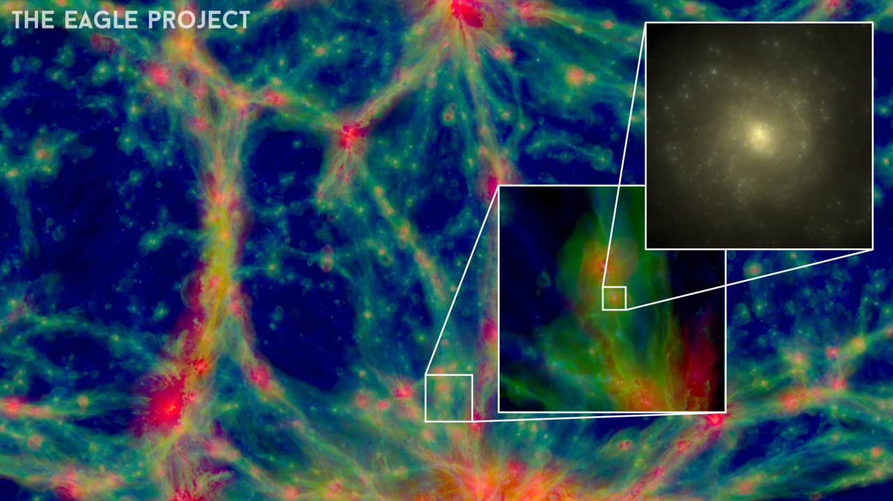

Tractable generative modelling of Cosmological Structure Formation

The purpose of this project is to show that machine learning can efficiently model non-linear large scale structure formation in the universe.

The dataset is generated through the [Eagle Simulations](http://icc.dur.ac.uk/Eagle/database.php).
[Sum-Product Networks](https://arxiv.org/abs/1202.3732) are the generative model used to learn cosmological structure formation.

For further introduction to SPNs, see [this](https://github.com/arranger1044/awesome-spn) curated list of resources dedicated to SPNs. The SPNs used are based on the brilliant [SPNFlow](https://github.com/SPFlow/SPFlow) library.

For an introduction to Eagle simulations, see [this](http://icc.dur.ac.uk/Eagle/index.php). To use the public dataset, first register to log in to the Eagle simulations and use any of the queries provided in the folder sql_queries. The dataset can be quite huge but connection times out after 30 minutes. 

